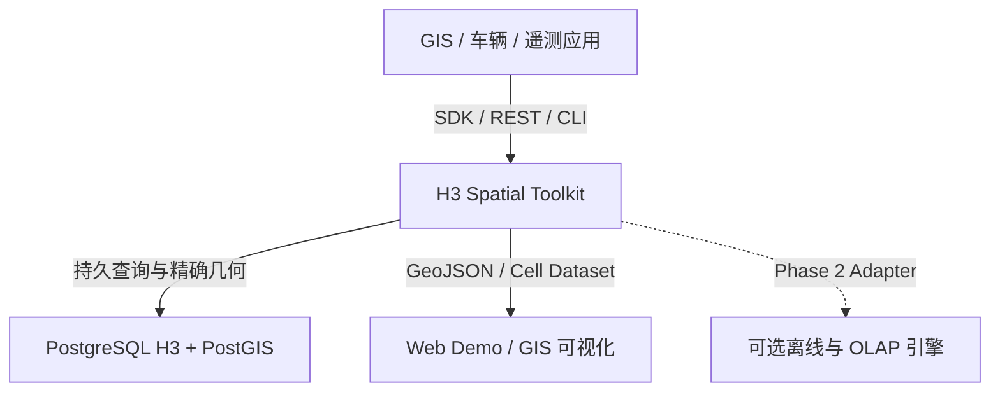
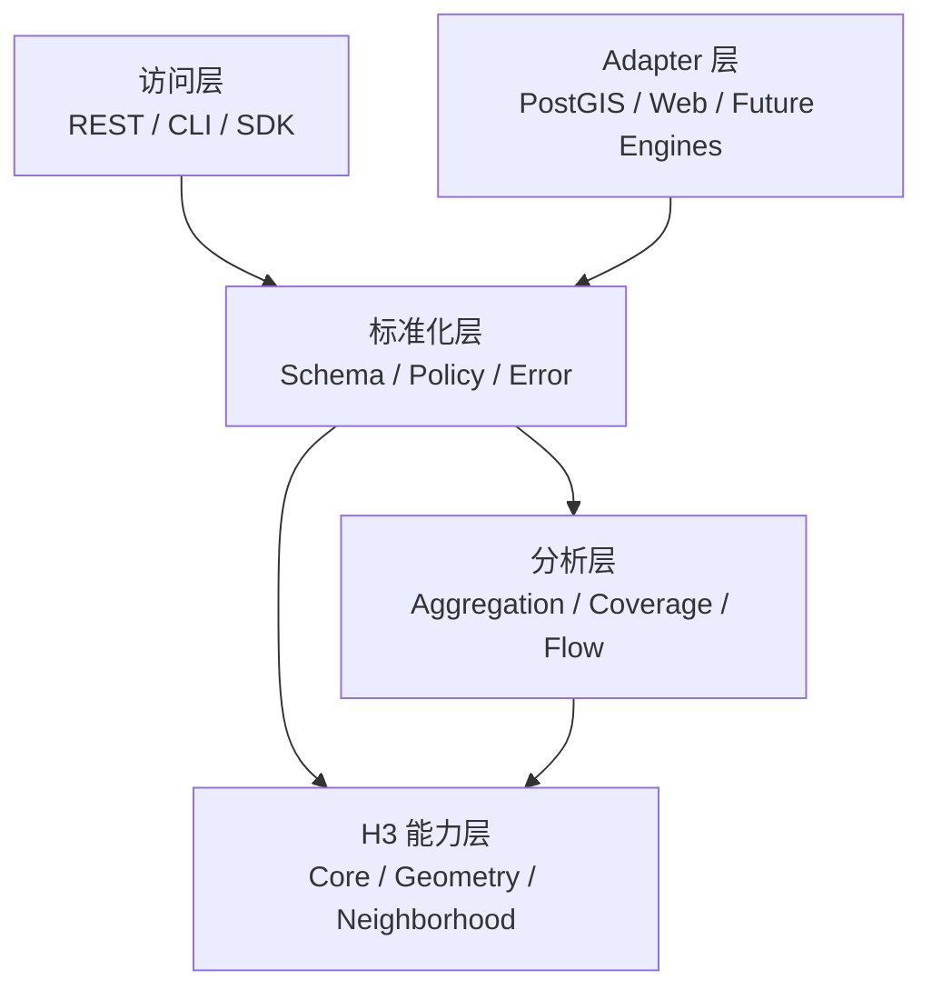
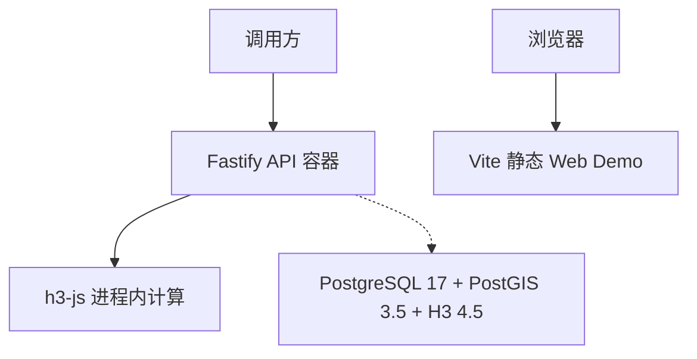
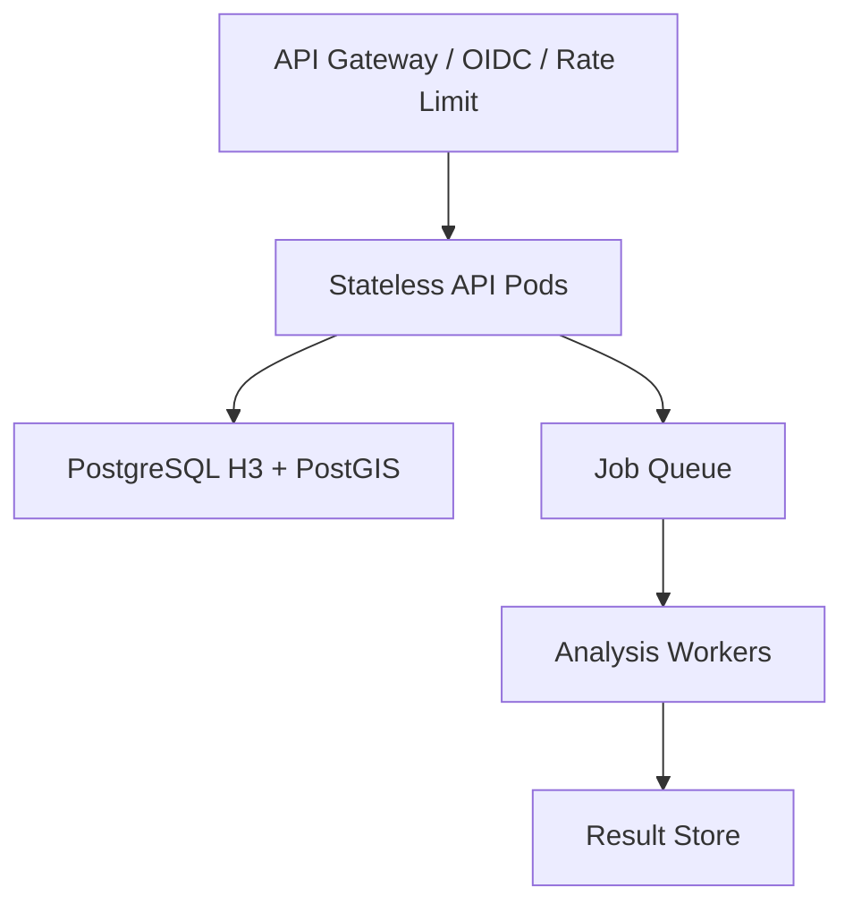
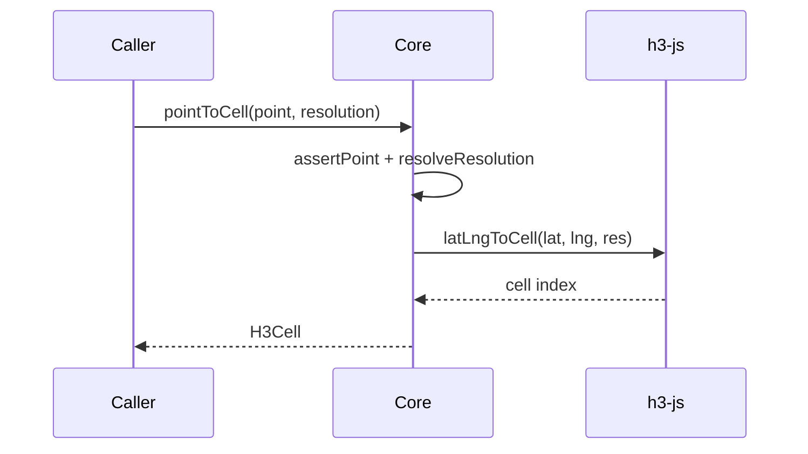
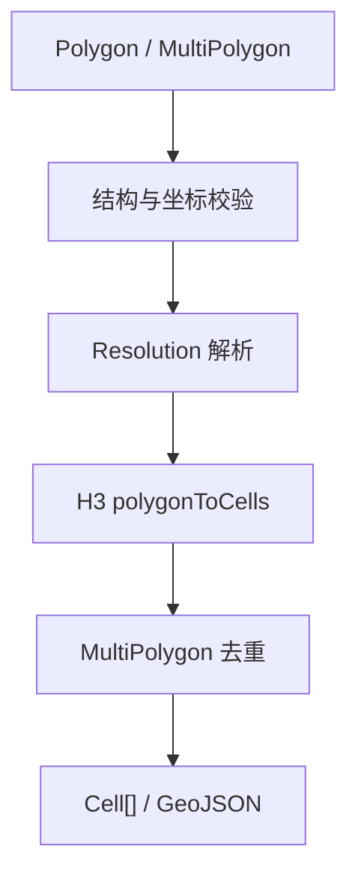
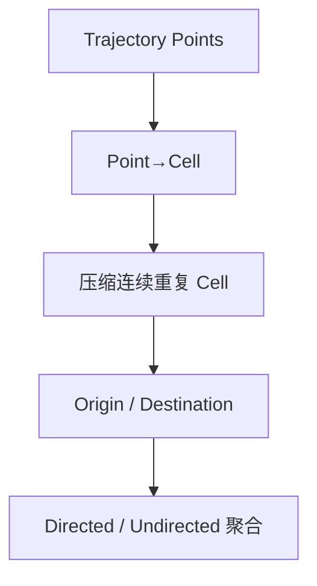
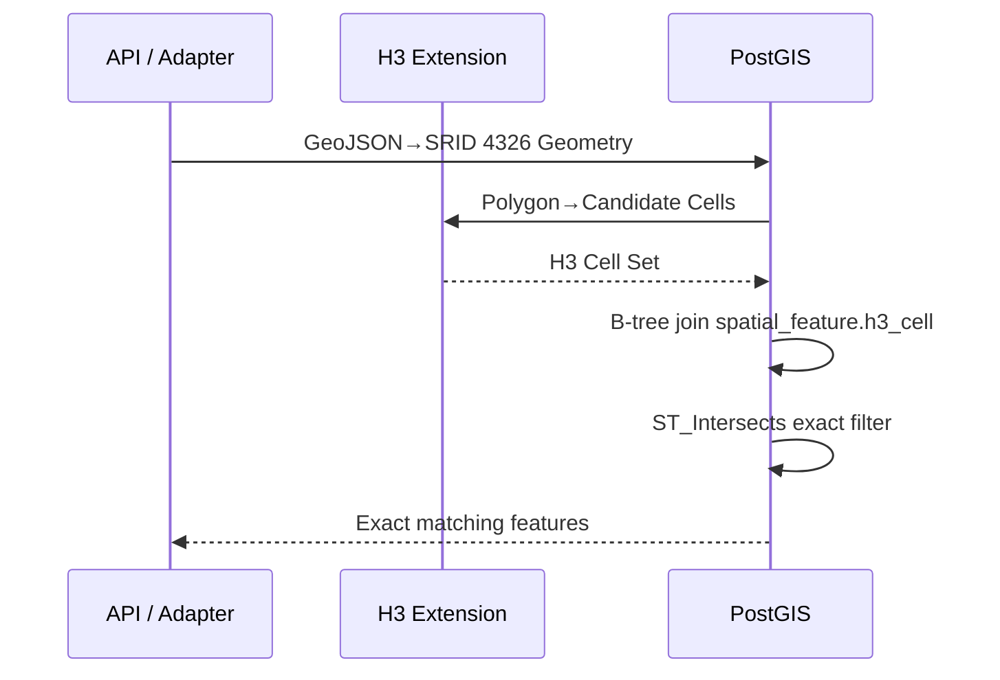
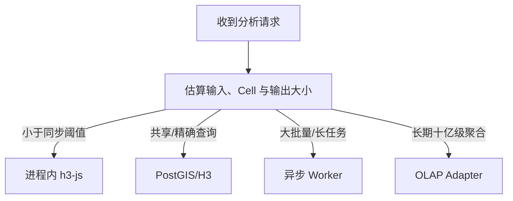

# H3 Spatial Toolkit 系统详细设计

| 项目 | 内容 |
|---|---|
| 文档版本 | V1.0 |
| 对应软件基线 | `h3-spatial-toolkit@0.3.0` |
| 编制日期 | 2026-08-11 |
| 架构结论 | TypeScript Toolkit + 可选 PostgreSQL/PostGIS/H3 Adapter |
| 状态 | 详细设计基线；生产化扩展项单独标注 |

## 1. 文档目的

本文把可行性探索结果和现有 PoC 代码固化为可实施的系统设计，作为后续编码、接口评审、数据库认证、部署和验收的共同基线。它回答以下问题：

1. 哪些能力属于纯 H3 SDK，哪些属于空间分析组合能力，哪些必须由 PostGIS 提供。
2. Node.js、PostgreSQL/H3、Web Demo 和未来异步计算之间如何分工。
3. 坐标、Resolution、Schema、错误和版本如何保持一致。
4. 点索引、Polygon 覆盖、邻域、聚合、Coverage 和 Flow 的处理流程是什么。
5. 当前 `0.3.0` 已实现什么，生产部署前还必须补什么。

除特别标记为“目标设计”或“Phase 1/2”外，本文描述均与当前源码一致。

## 2. 设计结论

### 2.1 总体决策

采用“同步 Toolkit 为主、数据库 Adapter 可选、精确几何归 PostGIS”的分层架构：

- `h3-js@4.5.0` 是 Node.js/浏览器内 H3 运算的唯一实现源，不重新实现 H3 算法。
- Toolkit 负责坐标契约、Resolution Policy、输入校验、标准 Schema 和组合分析。
- PostgreSQL H3 保存和查询 H3 索引，PostGIS 保存真实 Geometry 并执行精确空间关系。
- H3 只作为离散网格、粗筛键和聚合维度，不替代真实几何、投影或精确距离。
- 大 Polygon、大批量和长时间任务在生产版进入异步作业，不阻塞同步 API。
- DuckDB、ClickHouse、Sedona 均为可替换执行 Adapter，不进入当前核心依赖。

### 2.2 当前实现与目标状态

| 能力 | 当前 `0.3.0` | 生产目标 |
|---|---|---|
| TypeScript SDK | 已实现 | 保持纯函数和稳定 Schema |
| REST/OpenAPI | 6 个业务端点、liveness/readiness、统一响应、请求 ID、同步限额和平台中立鉴权边界已实现 | 接入具体 IdP/JWKS、租户持久化、Gateway 配额和异步作业 |
| CLI | 已实现 6 个命令 | 增加流式输入、进度、分片输出 |
| PostGIS/H3 | Docker/DDL/Adapter、Golden 与证据自动化已提供 | 在目标环境完成构建、迁移、计划、恢复和性能认证 |
| Web Demo | deck.gl 动态加载 + SVG fallback + bundle budget；Chromium/Firefox/WebKit 的 WebGL/SVG/键盘/缩放/Axe 9/9 通过 | 静态生产部署与跨平台持续矩阵 |
| 可观测性 | Fastify 结构化日志、认证头脱敏、低基数 Prometheus 指标 | OTel exporter、Trace、SLO、告警和审计 |
| 安全 | 输入/结果限额、语义校验、脱敏、源码 SBOM/许可清单、缺省本地模式和 fail-closed 注入鉴权契约 | OIDC/JWKS 或 mTLS、持久租户隔离、Gateway rate limit、无未处置扫描项、镜像签名 |
| 大任务 | 未实现 | Job API + Worker + 对象存储 |
| 运行布局 | 26.0 MB production-only API deploy、non-root Dockerfile；本地 API/PostgreSQL 镜像已 build/scan，但 source-label 绑定前扫描以 3 Critical + 19 High 失败 | 绑定当前 commit 后重扫、处置漏洞、固定发布 digest 并完成集群运行认证 |
| OLAP/离线 | 未实现 | DuckDB/ClickHouse Adapter，按负载证据引入 |

## 3. 范围与边界

### 3.1 系统内能力

| 编号 | 能力 |
|---|---|
| FR-001 | Point 与 H3 Cell 双向转换 |
| FR-002 | Cell boundary、Polygon/MultiPolygon 覆盖和 Cells→GeoJSON |
| FR-003 | Parent、Children、Center Child、Compact、Uncompact |
| FR-004 | Neighbor、Disk、Ring、Distance、Path |
| FR-005 | Count、Sum、Average、Min、Max、Weighted、Density、Distinct 聚合 |
| FR-006 | Required/Visited/Missing/Duplicate Coverage 计算 |
| FR-007 | Trajectory→Cell Sequence→OD/Flow 聚合 |
| FR-008 | JSON/CSV/GeoJSON 标准输入输出 |
| FR-009 | REST、CLI、TypeScript SDK 三种访问方式 |
| FR-010 | PostgreSQL H3/PostGIS 持久化和两阶段空间查询 |
| FR-011 | H3 网格结果可视化验收 |
| FR-012 | 10K–10M 基准和边界回归验证 |

### 3.2 系统外能力

以下不由本 Toolkit 直接承担：

- 地图瓦片、底图版权、坐标纠偏和地址地理编码。
- PostGIS 的精确拓扑、Buffer、投影转换、路网匹配和路径规划。
- GPS 清洗、漂移过滤、轨迹插值、设备状态判定。
- Getis-Ord Gi*、Local Moran’s I、时空异常检测等统计模型。
- 多租户用户体系、审批、业务工作流和态势事件处置。
- ClickHouse/Spark/Flink 集群本身的生命周期管理。

Toolkit 可以为态势分析提供统一空间分桶、邻域、时间聚合、覆盖和流向特征；统计显著性、预测和业务判断仍由上层分析服务负责。

## 4. 设计原则

1. **Reuse first**：H3 索引、遍历、层级和边界调用官方实现。
2. **坐标只转换一次**：外部始终是 `longitude, latitude`，只有 Core/数据库 Adapter 可适配底层调用顺序。
3. **Resolution 是业务语义**：所有指标必须携带 Resolution，禁止只保存 Cell 之外的隐式尺度。
4. **H3 粗筛、PostGIS 精算**：最终空间包含、相交和距离结论不能只依赖 Cell 相等。
5. **纯核心、薄适配**：Analysis 包不依赖 Fastify、数据库或 Web 框架。
6. **同步有上限**：所有批量、输出 Cell 数、半径和请求时长必须有硬门禁。
7. **结果可复验**：版本、输入摘要、Resolution、算法和时间窗必须可追踪。
8. **能力状态真实**：未执行的数据库门禁不得标记为通过。

## 5. 系统上下文



### 5.1 参与者

| 参与者 | 典型请求 | 关注点 |
|---|---|---|
| GIS 应用 | Polygon→Cells、Cells→GeoJSON | 坐标和几何正确性 |
| 车辆/机器人服务 | Point→Cell、Coverage、Flow | 低延迟和连续轨迹 |
| 遥测平台 | H3×Time 聚合 | 吞吐、流式和可追溯性 |
| 分析人员 | 邻域、覆盖差异、OD | 语义、尺度和可解释性 |
| 平台运维 | API/DB 部署和升级 | SLO、容量、备份、安全 |
| 前端评审者 | Resolution 与网格视觉检查 | 可视化一致性 |

## 6. 逻辑架构



### 6.1 分层职责

| 层 | 负责 | 不负责 |
|---|---|---|
| 访问层 | 协议解析、批量限制、序列化、OpenAPI、CLI I/O | H3 算法和业务持久化 |
| 标准化层 | 坐标、Resolution、Schema、错误和数据模型 | HTTP、SQL 和 UI |
| 分析层 | 聚合、Coverage、Flow 等可组合算法 | 精确几何和数据库事务 |
| H3 能力层 | Index、Hierarchy、Traversal、Region | 业务事件含义 |
| Adapter 层 | SQL、数据库连接、可视化、未来执行引擎 | 改变核心数据契约 |

### 6.2 包依赖规则

| 包 | 主要导出 | 可依赖 | 禁止依赖 |
|---|---|---|---|
| `core` | Point/Cell/Hierarchy/Policy/Error | `h3-js` | 其他 Toolkit 包、Fastify、pg |
| `geometry` | Polygon/Line/Cells/GeoJSON | `core`、`h3-js` | 数据库和 HTTP |
| `neighborhood` | Disk/Ring/Distance/Path | `core`、`h3-js` | Geometry、数据库 |
| `aggregation` | 八类聚合 | `core`、`h3-js` | HTTP、数据库 |
| `coverage` | Coverage Result/Difference | `core`、`geometry` | HTTP、数据库 |
| `flow` | Trajectory/OD/Flow | `core` | HTTP、数据库 |
| `io` | Schema/CSV/JSON | `core` 类型 | 分析实现、数据库 |
| `postgis` | DB Adapter/SQL | `core`、`pg` | API 和 Web |

循环依赖视为架构门禁失败。`apps/*` 可以组合包，但包不得反向依赖应用。

## 7. 部署架构

### 7.1 当前部署



当前业务 API 全部走进程内计算，`DATABASE_URL` 已预留但尚未接入 REST handler。PostGIS Adapter 由 SDK 调用者显式创建。数据库是可选能力，不影响纯 Toolkit 启动。

### 7.2 生产目标拓扑



生产目标中，同步请求由无状态 API Pod 执行；超限任务写入 Job Queue，由 Worker 分片计算并把大结果写入对象存储。数据库连接只存在于 API/Worker Adapter，不进入浏览器或纯 SDK。

### 7.3 高可用边界

- API 至少 2 个实例，滚动发布，`SIGTERM` 后停止接收新请求并等待在途请求。
- PostgreSQL 使用受管高可用或主备；H3/PostGIS 扩展版本在主从一致。
- Web Demo 作为静态资源部署，不与 API 发布强绑定。
- Job Queue 和 Result Store 是 Phase 1 组件；未启用时 API 必须明确拒绝超限请求，而不是内存硬算。

## 8. 核心数据契约

### 8.1 坐标与 CRS

| 场景 | 契约 |
|---|---|
| GeoJSON | EPSG:4326，Position 为 `[longitude, latitude]` |
| TypeScript Point | `{ longitude, latitude }` |
| REST Point | `longitude ∈ [-180,180]`，`latitude ∈ [-90,90]` |
| h3-js 内部 | Core 适配为 `(latitude, longitude)` |
| PostGIS | `geometry(...,4326)`；`ST_MakePoint(longitude, latitude)` |
| H3 Index JSON | 小写 15 位十六进制字符串，不转 JavaScript Number |

禁止根据数值范围自动交换坐标。像 `[35, 139]` 这类两个值都合法的错误只能通过明确字段、固定样例和端到端测试发现。

### 8.2 Resolution Policy

| Policy | Res | 典型用途 | 同步约束 |
|---|---:|---|---|
| `GLOBAL` | 2 | 全球态势 | 不作局部精度结论 |
| `REGIONAL` | 4 | 国家/大区域 | 可直接可视化 |
| `CITY` | 7 | 城市分布 | 跨城比较 |
| `DISTRICT` | 8 | 区县运营 | 默认候选 |
| `STREET` | 10 | 街区/车辆 | 大区域需预估 Cell 数 |
| `FINE` | 12 | 精细局部 | 强制面积和结果上限 |

原始 Resolution 0–15 可由 SDK 接受；REST 已通过 `ALLOWED_RESOLUTIONS` 配置 allow-list，并在启动时校验。Policy 到整数的映射属于 API 版本的一部分，修改需要 ADR、回归和版本说明。

### 8.3 标准对象

```ts
interface H3Cell {
  index: string;
  resolution: number;
}

interface H3Metric {
  cell: string;
  resolution: number;
  metric: string;
  value: number;
}

interface H3TimeMetric extends H3Metric {
  timestamp: string;
  bucket: "minute" | "hour" | "day" | "week" | "month";
}

interface H3Flow {
  origin: string;
  destination: string;
  count: number;
  weight?: number;
}
```

### 8.4 数据不变量

- `H3Cell.resolution === getResolution(H3Cell.index)`。
- 同一 `H3Metric` 数据集不得混用 Resolution 或算法版本。
- `H3Flow.origin` 与 `destination` 必须同 Resolution。
- 时间指标使用 UTC ISO-8601；Bucket 表示聚合粒度，不表示时区。
- Density 当前定义为 `record count / cell exact area(km²)`。
- Coverage 的 visited 只统计 Required Area 内的 Cell；区域外访问只影响效率分母。
- 有向和无向 Flow 必须使用不同 dataset/metric 标识。

## 9. 输入校验设计

### 9.1 校验顺序

1. 协议层校验 JSON 类型、必填字段、body 大小和数组长度。
2. 标准层校验 Resolution、经纬度、H3 Cell 和有限数值。
3. Geometry 层校验类型、非空、Ring 点数、闭合和坐标范围。
4. 数据库路径校验 SRID、`ST_IsValid`、Geometry 类型和空间范围。
5. 计算前估算结果 Cell 数、响应大小和预计耗时。

### 9.2 Geometry Policy

当前 SDK 只做结构校验，不判断自相交、洞拓扑、ring winding 和精确有效性。生产数据库路径应执行：

```sql
SELECT
  ST_SRID(geom) = 4326 AS srid_ok,
  ST_IsValid(geom) AS valid,
  ST_IsValidReason(geom) AS reason,
  GeometryType(geom) AS geometry_type;
```

`ST_MakeValid` 不能默认静默执行，因为它可能改变拓扑。修复策略必须由调用方显式选择，并在结果元数据记录 `geometryRepaired=true` 与修复前后摘要。

### 9.3 Antimeridian、极区和 Pentagon

- 跨日期变更线 Polygon 应先按业务语义规范化/切分，并执行金标测试。
- PostGIS 平面运算推荐 `SET h3.extend_antimeridian TO false`。
- 极区 Cell 和 Pentagon 邻域可能少于常规六边形数量，调用方不能假定固定 6 邻居。
- `gridDistance`/`gridPath` 可能因 Pentagon distortion 或距离过远失败，失败必须结构化返回，不能生成伪连续路径。

## 10. 核心模块详细设计

### 10.1 Core

#### Point→Cell



时间复杂度为单点常数级；批量 N 点为 `O(N)`。输出显式携带 Resolution，避免调用方再次解析。

#### Cell→Point/Boundary

- 先使用 `isValidCell` 拒绝非法 Index。
- `cellToPoint` 把 h3-js 返回的 `[lat,lng]` 重新映射为对象字段。
- `cellToBoundary` 请求 GeoJSON 顺序并确保首尾闭合。
- Boundary 是 H3 Cell 的球面离散边界表达，不替代原始业务 Geometry。

#### Hierarchy

- Parent Resolution 不得大于当前 Resolution。
- Child Resolution 不得小于当前 Resolution。
- Compact 前去重；Uncompact 目标 Resolution 必须由统一 Policy 解析。
- 跨层指标汇总需要定义 `sum/count/weighted` 语义，不能简单平均已聚合平均值。

### 10.2 Geometry

#### Polygon/MultiPolygon→Cells

算法使用 H3 中心点包含语义。MultiPolygon 分片计算后以 Set 去重；洞由原始 ring 结构传给 H3。



目标生产门禁：在计算前根据面积、Resolution 和官方平均 Cell 面积估算输出；估值超过同步阈值时返回 `413/422` 或转异步 Job。

#### LineString→Cells

先把每个 Vertex 映射为 Cell，再用 `gridPathCells` 补齐相邻 Vertex Cell 间路径，最后压缩连续重复 Cell。当前回退策略在路径失败时只追加终点 Cell，可能产生不连续序列；生产轨迹分析应返回 warning 或失败，并由轨迹插值/地图匹配服务处理，不能把回退结果解释为真实行驶路径。

#### Cells→Geometry

- `cellsToPolygon` 生成合并 MultiPolygon，适合区域轮廓。
- `cellsToGeoJSON` 每 Cell 生成一个 Feature，适合拾取、审计和 Web 渲染。
- 大结果优先输出压缩 Cell 列表；GeoJSON 边界通常显著放大响应体。

### 10.3 Neighborhood

| 操作 | 语义 | 风险/限制 |
|---|---|---|
| `neighbors` | k=1 且排除自身 | Pentagon 附近数量变化 |
| `gridDisk` | 距离不超过 k，包含自身 | Cell 数约随 `k²` 增长 |
| `gridRing` | 恰为 k 的环 | Pentagon distortion |
| `gridDistance` | 网格步数 | 不是米制精确距离 |
| `gridPath` | 一条最短 Cell 路径 | 跨 Pentagon/远距离可能失败 |
| `isNeighbor` | 邻接判断 | 两个 Cell 必须有效且同层语义明确 |

SDK 允许 `k≤1000`；REST 默认 `MAX_NEIGHBOR_RADIUS=20`，并以 `1+3k(k+1)` 预估和实际结果执行 `MAX_RESULT_CELLS` 双门禁。

### 10.4 Aggregation

每个 Cell 维护以下单遍状态：

```text
count, sum, min, max, weightedSum, weightSum, distinctSet
```

| Operation | 结果公式 |
|---|---|
| count | `count` |
| sum | `sum(value)` |
| average | `sum / count` |
| min/max | 状态极值 |
| weightedAverage | `weightedSum / weightSum`；零权重返回 0 |
| density | `count / cellAreaKm2` |
| distinctCount | `distinctSet.size` |

时间复杂度 `O(N)`，空间复杂度为 `O(G + D)`，其中 G 为 Cell 分组数，D 为 distinct 集大小。`distinctCount` 对高基数输入不适合无限同步处理；Phase 1 应增加 HyperLogLog/数据库近似实现或显式上限。

### 10.5 Coverage

定义：

- `requiredCells`：Area 在指定 Resolution 下的 Cell 集。
- `visitedCells`：Required 集内至少访问一次的 Cell。
- `missingCells = required - visited`。
- `duplicateVisitCount`：Required Cell 上超过第一次的访问总数。
- `coverageRatio = visitedRequiredCount / requiredCount`。
- `coverageEfficiency = visitedRequiredCount / allVisitCount`。

空 Required Area 的 Coverage Ratio 定义为 1；无访问时 Efficiency 定义为 0。该定义适合网格覆盖评估，不等价于道路长度覆盖率或真实面积覆盖率。

生产补强项：验证 `visitedCells` 的合法性与 Resolution；对区域外访问单独输出 `outsideCells/outsideVisitCount`；返回输入/策略摘要以支持复验。

### 10.6 Flow

处理链路：



- 少于两个不同 Cell 的轨迹不生成 OD。
- 有向模式按 `origin→destination` 分组。
- 无向模式把字典序较小 Cell 放在 origin，从而形成稳定无向键。
- 当前 `weight` 是轨迹点 weight 总和；业务若表示乘员数、货重或置信度，应在上层固定语义。
- Flow 不是道路路线；真实路径需地图匹配/路由服务。

### 10.7 IO

- JSON Schema 是跨语言契约，TypeScript Interface 只是编译期表达。
- CSV Writer 支持引号、逗号和换行转义；Parser 面向基础 CSV，不替代大型 RFC 4180 流式解析器。
- 大文件目标设计使用 Node Stream，逐块读取、聚合和写出，避免一次性载入内存。

### 10.8 PostGIS Adapter

Adapter 负责：

- 通过 `ST_MakePoint(longitude, latitude)` 调用 `h3_latlng_to_cell`。
- 通过 `h3_polygon_to_cells(geometry, resolution)` 执行数据库侧覆盖。
- 通过 `h3_cell_to_boundary_geometry` 返回 GeoJSON Polygon。
- 检查 PostGIS 与 H3 扩展版本。
- 提供 H3 粗筛 + `ST_Intersects` 精确过滤 SQL。

连接池、事务、statement timeout、tenant context 和 retry 应由生产 Adapter Factory 配置，不在纯 Core 内实现。

## 11. REST API 详细设计

### 11.1 通用协议

| 项目 | 当前设计 | 生产补强 |
|---|---|---|
| Base path | `/v1/h3` | 保持版本化 |
| Content type | `application/json` | 可增加 NDJSON/Arrow 异步结果 |
| 成功响应 | `{ "data": ..., "meta": {...} }` | 保持版本化并增加 tenant/job 元数据 |
| 校验错误 | HTTP 400 | 保持 |
| 业务语义错误 | HTTP 422 | 保持并细化错误码 |
| Body | 10 MiB | Gateway 与服务一致配置 |
| Timeout | 30s | 同步接口硬超时；异步任务独立 |
| Batch | 默认 100,000 | 按租户、端点和 Resolution 动态限制 |
| 身份 | `local` 默认不启用；`required` 必须注入已验证 Principal 的 authenticator | 接入具体 OIDC/JWKS 或 mTLS，统一 Gateway 与服务端 Scope |

目标成功响应：

```json
{
  "data": [],
  "meta": {
    "requestId": "01J...",
    "toolkitVersion": "0.3.0",
    "engine": "h3-js",
    "engineVersion": "4.5.0",
    "durationMs": 28.1,
    "warnings": []
  }
}
```

### 11.2 端点

| Method/Path | 输入 | 输出 | 同步门禁 |
|---|---|---|---|
| `POST /v1/h3/index` | `points[]`, `resolution` | `H3Cell[]` | Points≤100K |
| `POST /v1/h3/polygon/cover` | `geometry`, `resolution`, `output?` | `Cell[]` 或 FeatureCollection | 面积、预计 Cell、结果字节数 |
| `POST /v1/h3/neighbors` | `cell`, `radius?` | `Cell[]` | radius 和结果 Cell 上限 |
| `POST /v1/h3/aggregate` | `records[]`, `operation`, `resolution`, `metric?` | `H3Metric[]` | Records≤100K；Distinct 单独限额 |
| `POST /v1/h3/coverage` | `area`, `visitedCells?`, `visitedPoints?`, `resolution` | `CoverageResult` | Required+Visited 结果上限 |
| `POST /v1/h3/flow` | `trajectories[][]`, `resolution`, `directed?` | `H3Flow[]` | 应限制总点数，不只轨迹数 |
| `GET /health` | 无 | process liveness | 不访问 DB |
| `GET /ready` | 无 | H3 self-check/readiness | 当前 REST 不依赖 DB，明确返回 `database=not-required` |

### 11.3 错误模型

当前错误结构：

```json
{
  "error": {
    "code": "RESULT_CELL_LIMIT_EXCEEDED",
    "message": "Estimated polygon result exceeds server policy",
    "details": {
      "actual": 1250000,
      "limit": 250000,
      "recommendedResolution": 8
    }
  },
  "meta": {
    "requestId": "01J...",
    "durationMs": 1.2,
    "toolkitVersion": "0.3.0",
    "engine": "h3-js",
    "engineVersion": "4.5.0",
    "warnings": []
  }
}
```

| 错误码 | HTTP | 含义 |
|---|---:|---|
| `INVALID_LONGITUDE` / `INVALID_LATITUDE` | 422 | 坐标越界 |
| `INVALID_RESOLUTION` | 422 | Resolution 非 0–15/未知 Policy |
| `INVALID_H3_CELL` | 422 | 非法 Cell |
| `INVALID_GEOMETRY` | 422 | Geometry 结构或拓扑不符合策略 |
| `BATCH_LIMIT_EXCEEDED` | 413 | 输入数量超限 |
| `RESULT_CELL_LIMIT_EXCEEDED` | 413 | 预计/实际 Cell 超限 |
| `GRID_PATH_UNAVAILABLE` | 422 | H3 无法给出可靠路径 |
| `REQUEST_TIMEOUT` | 408 | HTTP 请求接收超时；当前同步 CPU handler 不可抢占 |
| `DATABASE_UNAVAILABLE` | 503 | 数据库 Adapter 不可用 |
| `AUTHENTICATION_REQUIRED` / `AUTHENTICATION_FAILED` | 401 | 缺少或无效身份；不回显验证细节 |
| `AUTHORIZATION_DENIED` | 403 | 已验证 Principal 缺少端点 Scope |
| `INTERNAL_ERROR` | 500 | 未知错误；不暴露堆栈 |

错误 Handler 已读取 `H3ToolkitError.code`，加入 Request ID、稳定 HTTP 分类和 details allow-list。未知错误固定为 `INTERNAL_ERROR`，不向调用方回显原始消息、堆栈、SQL、内部路径、Cell 或坐标。

`REQUEST_TIMEOUT_MS` 当前接线到 Fastify `requestTimeout`，只能约束请求接收阶段。同步 H3 计算期间事件循环无法触发硬超时，因此计算截止时间仍是未完成项；生产实现应使用 worker thread/可分块 deadline 或由 Gateway 终止并明确 503/504 契约，不能把接收超时证据冒充计算超时。

### 11.4 异步 Job API（目标设计）

| Method/Path | 用途 |
|---|---|
| `POST /v1/jobs/h3/polygon-cover` | 创建超大 Polygon 覆盖任务 |
| `POST /v1/jobs/h3/aggregate` | 创建大批量聚合任务 |
| `GET /v1/jobs/{jobId}` | 查询状态和进度 |
| `DELETE /v1/jobs/{jobId}` | 尝试取消 |
| `GET /v1/jobs/{jobId}/result` | 获取分页结果或结果文件引用 |

Job 状态固定为 `PENDING → RUNNING → SUCCEEDED | FAILED | CANCELLED | EXPIRED`。创建请求需支持调用方 `idempotencyKey`，结果保存输入摘要、引擎版本、Resolution、计数和 checksum。

## 12. CLI 详细设计

| 命令 | 主要参数 | 输出 |
|---|---|---|
| `h3 point` | `--lng --lat --resolution` | JSON/CSV H3Cell |
| `h3 polygon` | `--input --resolution --output-type` | Cells/GeoJSON |
| `h3 neighbors` | `--cell --k` | Cells |
| `h3 aggregate` | `--input --operation --resolution --metric` | H3Metric |
| `h3 coverage` | `--input --resolution` | CoverageResult |
| `h3 flow` | `--input --resolution --directed` | H3Flow |

退出码：成功 `0`，参数/计算/I/O 失败 `1`。Phase 1 建议细化为参数 `2`、I/O `3`、计算 `4`、外部依赖 `5`，并提供 `--quiet`、`--log-format json`、`--max-records` 和 NDJSON 流式模式。

## 13. 数据库详细设计

### 13.1 扩展基线

- PostgreSQL 17。
- PostGIS 3.5。
- `h3` 与 `h3_postgis` 4.5.0。
- 安装顺序：PostGIS → H3 → H3 PostGIS。
- 生产镜像必须使用 digest 固定基础镜像，并生成 SBOM；构建期编译工具不得留在运行层。

### 13.2 `spatial_feature`

| 字段 | 类型 | 说明 |
|---|---|---|
| `id` | bigint identity | 技术主键 |
| `feature_type` | text | 业务类型 |
| `properties` | jsonb | 扩展属性 |
| `geom` | geometry(Geometry,4326) | 权威真实几何 |
| `h3_cell` | h3index | 查询/聚合主 Cell |
| `observed_at` | timestamptz | 事件时间，可空 |

索引：Geometry GiST、H3 B-tree、observed_at B-tree。追加 Migration 已对 Point 写入强制 Geometry/Cell 一致性并拒绝空 Point，同时保留通用 Geometry 的明确边界。生产还需：

- 按 `feature_type` 和时间范围决定是否分区。
- 写入服务继续统一从 Geometry/Point 计算 `h3_cell`；数据库约束作为最终防线。
- 多 Resolution 业务若需要固定 Resolution，再增加配置化约束或显式列；当前 Point 约束验证 Cell 与 Geometry 计算结果一致。
- `properties` 高频过滤字段应升为类型化列，避免所有查询扫描 JSONB。

### 13.3 `h3_metric`

逻辑唯一键为：

```text
(cell, metric, bucket, bucket_start)
```

`resolution` 用于显式契约与查询，无论 Cell 已编码 Resolution 都必须保留。生产增加约束 `h3_get_resolution(cell)=resolution`。固定 Res 7 的 Parent 表达式索引只适用于 `resolution≥7` 的行。

`aggregate.sql` 的 `ON CONFLICT` 目标已与四列主键完全一致，并有事务内重复执行、更新值和回滚断言。完整 G4 仍需由一次 run-scoped runner 将该断言与最终镜像、规模、计划和恢复证据绑定。

### 13.4 两阶段空间查询



设计要求：

- H3 阶段只能减少候选集合，不能作为最终 exact predicate。
- Query Geometry 必须有效且为 SRID 4326。
- H3 粗筛 Resolution 由数据 Cell Resolution 决定，不能任意指定导致 join 永远不匹配。
- 必须用 `EXPLAIN (ANALYZE, BUFFERS)` 验证 B-tree 和 GiST 是否命中。
- 极大 Polygon 可以改为临时候选表/物化 Cell 集，避免 CTE 结果和重复计算膨胀。

### 13.5 时间聚合

建议生产 SQL 使用事务和一致的 Bucket：

1. 按时间窗筛选 `spatial_feature`。
2. 把 Cell 归并到目标 Parent Resolution。
3. `date_trunc` 形成 UTC Bucket。
4. 按 `(cell, bucket_start)` 聚合。
5. 以完整唯一键 Upsert。
6. 记录 job_id、source watermark 和 source_count 供 Reconciliation。

### 13.6 数据保留与分区

| 数据 | 建议 |
|---|---|
| `spatial_feature` 高频事件 | 按月/日 Range Partition，按实际写入量决定 |
| `h3_metric` | 按 `bucket_start` Range Partition，历史只读 |
| 无时间 Feature | 独立表或专用默认分区，不用 `-infinity` 承载大规模混合数据 |
| 大结果 | 对象存储，数据库只存 Job 元数据与 Result URI |

删除策略、归档和隐私期限由业务数据分类决定，不在 Toolkit 内硬编码。

## 14. 性能与容量设计

### 14.1 已测基线

当前可比较环境：Windows x64、Node `v22.14.0`、16 CPUs、h3-js 4.5.0、CPU/OS/内存档位完整匹配。以下验证与同环境基线逐项比较，阈值为 20%；它仍只用于容量起点，不是跨机器 SLO：

| 场景 | 数据量 | 实测吞吐/耗时 |
|---|---:|---:|
| Point→H3 | 10M | 709,136 records/s，14,101.67ms；比较 PASS |
| Streaming-style aggregation | 10M | 600,192 records/s，16,661.34ms；比较 PASS |
| Small Polygon Res 9 | 64 cells | 14.08ms；比较 PASS |
| Medium Polygon Res 9 | 25,945 cells | 136.35ms；比较 PASS |
| Large Polygon Res 9 | 647,905 cells | 1,941.57ms；比较 PASS |

9 个同环境场景全部在阈值内。历史 Linux Node 24 记录缺少 CPU 型号、OS release 和内存档位，明确标记为 `NOT_COMPARABLE`，不得作为跨机器回归 PASS。

### 14.2 建议同步预算

| 资源 | MVP 当前 | 生产建议起点 |
|---|---:|---:|
| Request body | 10 MiB | 保持；Gateway 同值 |
| Point/Aggregate records | 100K | 按租户 10K–100K |
| Polygon result cells | 未硬限制 | 250K；更大转异步 |
| Neighbor radius | 1000 | 按 Resolution 动态限制，默认不超过 50 |
| Flow | 100K trajectories | 改为总点数≤100K |
| 同步超时 | 30s | API 内部预算 25s，预留网络清理时间 |
| GeoJSON 输出 | 未独立限制 | 50 MiB 或更低，超限输出 Cell/异步文件 |

阈值必须通过目标硬件并发压测修订。只看 H3 CPU 吞吐不够，JSON 解析、内存复制、GeoJSON 膨胀、日志和响应传输往往更早成为瓶颈。

### 14.3 容量决策



## 15. 可靠性与一致性

### 15.1 确定性

- 同版本、同输入、同 Resolution 的 Point→Cell 和 Polygon→Cells 集合应一致。
- 集合输出如果暴露顺序，必须排序；否则契约只承诺集合语义。
- `gridPath` 只承诺有效连续路径语义，不承诺跨 H3 版本的具体序列完全相同。
- 所有基准和异步结果记录 H3 引擎、Toolkit、Schema 与算法版本。

### 15.2 故障策略

| 故障 | 同步 API 行为 | 异步目标行为 |
|---|---|---|
| 输入非法 | 400/422，不重试 | Job 不创建 |
| 结果超限 | 建议降 Resolution 或转异步 | 分片/文件输出 |
| H3 路径失败 | 422 + 结构化原因 | 标记 FAILED，可选业务回退 |
| DB 连接失败 | 503，有限连接级重试 | 指数退避，保持幂等 |
| Worker 中断 | 不适用 | Lease 超时后从 checkpoint 恢复 |
| Result Store 失败 | 不适用 | 不标记成功，安全重试写入 |

禁止对非幂等数据库写入进行无条件自动重试。聚合作业使用 `job_id + partition + watermark` 作为幂等边界。

### 15.3 版本一致性

- `h3-js` 与 h3-pg 的 major/minor 保持一致。
- Patch 升级先跑跨引擎 Golden Dataset：Point、Boundary、Parent、Polygon、Pentagon、Antimeridian。
- Schema breaking change 使用新 Schema version 和 `/v2`，不能原地改变已有字段含义。

## 16. 安全设计

### 16.1 威胁与控制

| 威胁 | 控制 |
|---|---|
| 巨大 Polygon/深层坐标导致 CPU/内存耗尽 | body、depth、coordinate、area、estimated cells、timeout 限额 |
| 超大 k 导致邻域爆炸 | radius + maxResultCells 双限制 |
| 高基数 distinct 占满内存 | distinct 上限/近似算法/异步执行 |
| SQL 注入 | 参数化 SQL；禁止拼接 Geometry/Resolution |
| 非法 Geometry 放大数据库计算 | SRID/type/validity/area 预检 |
| 跨租户数据访问 | Gateway 身份 + DB tenant context/RLS 或物理隔离 |
| 错误回显泄露 | 生产隐藏 stack、SQL、连接信息和内部路径 |
| 依赖/镜像供应链 | lockfile、audit、SBOM、镜像扫描、签名、digest pin |

### 16.2 身份与授权

- 当前默认 `local` 模式保持本地开发兼容；`required` 模式没有注入 authenticator 时启动即失败。
- authenticator 只接收 Authorization、requestId、method 和 route，并只能返回已经验证的 `subject`、`tenantId`、`scopes`；租户 ID 不从 Header 或 Body 采信。
- 六个业务端点分别要求 `h3:index`、`h3:polygon:cover`、`h3:neighbors`、`h3:aggregate`、`h3:coverage`、`h3:flow`；Metrics 要求 `h3:metrics:read`。`/health` 与 `/ready` 保持最低信息的公开探针。
- 401/403 稳定失败、异常 authenticator、畸形 Principal、Scope 缺失和租户来源已有本地契约测试。
- 生产仍须接入具体 OIDC/JWKS 或服务间 mTLS，验证过期/撤销/轮换，并把 Principal 传播到数据库/Job/结果下载的租户隔离与审计边界。

## 17. 可观测性设计

### 17.1 日志

每个请求最少记录：

```text
timestamp, level, service, version, requestId, tenantId,
route, statusCode, durationMs, resolution, inputCount,
resultCount, engine, errorCode
```

不得记录完整坐标数组、Polygon 或业务属性。需要诊断时记录 canonical input hash 和采样摘要。

### 17.2 指标

| 指标 | 类型 | 关键标签 |
|---|---|---|
| `h3_http_requests_total` | Counter | method/route template/status |
| `h3_http_request_duration_seconds` | Histogram | method/route template/status |
| `h3_http_inflight_requests` | Gauge | 无标签 |
| `h3_http_errors_total` | Counter | normalized code/route template |
| `h3_input_records_total` | Counter | operation |
| `h3_result_cells` | Histogram | operation/resolution |
| `h3_job_queue_depth` | Gauge | job type |
| `h3_job_duration_seconds` | Histogram | job type/status |
| `h3_db_query_duration_seconds` | Histogram | query name |
| `h3_engine_mismatch` | Gauge | node/db version |

前四项已在当前 API 实现并有敏感值排除测试；后续业务/Job/DB 指标尚未实现。Resolution 即使基数可控也不进入当前 HTTP 指标；Cell、坐标、requestId 和 tenantId 不得作为指标标签。

### 17.3 Trace

Span 建议：`http.request → validate → estimate → h3.compute | db.query → serialize`。异步任务使用 trace link 连接创建请求与 Worker，不要求保持单个长 span。

### 17.4 SLO 建议

以下需目标环境压测确认：

- API 可用性：月度 99.9%，排除明确的 4xx。
- Point Batch≤10K：P95≤500ms，P99≤1s。
- Polygon 预计≤25K Cells：P95≤2s。
- 服务端 5xx：<0.1%。
- Job 成功率：≥99%，排除用户输入错误和主动取消。
- 数据库两阶段查询：按数据集分级建立独立 SLO，不使用统一静态值。

## 18. 配置设计

| 配置 | 当前默认 | 生产要求 |
|---|---:|---|
| `HOST` | `127.0.0.1` | 容器显式 `0.0.0.0` |
| `PORT` | `3000` | 平台注入 |
| `BODY_LIMIT_BYTES` | `10485760` | 与 Gateway 一致 |
| `MAX_BATCH_RECORDS` | `100000` | 按租户/端点细分 |
| `MAX_FLOW_POINTS` | `100000` | 所有轨迹总点数 |
| `MAX_RESULT_CELLS` | `250000` | 超限拒绝或转异步 |
| `MAX_GEOJSON_BYTES` | `10485760` | 序列化结果字节上限 |
| `MAX_POLYGON_COORDINATES` | `50000` | 深度/坐标资源保护 |
| `MAX_NEIGHBOR_RADIUS` | `20` | 与结果门禁同时执行 |
| `MAX_DISTINCT_VALUES` | `50000` | 高基数保护 |
| `ALLOWED_RESOLUTIONS` | `0,...,15` | REST Resolution allow-list |
| `REQUEST_TIMEOUT_MS` | `30000` | 与 Gateway 协调 |
| `METRICS_ENABLED` | `true` | 平台决定是否暴露或由 sidecar 采集 |
| `DATABASE_URL` | 本地样例 | Secret 注入，不进日志 |
| `LOG_LEVEL` | `info` | 环境化 |

上述本地同步配置已完成类型和范围校验，非法配置直接失败启动。后续平台配置仍包括 `DB_STATEMENT_TIMEOUT_MS`、`OTEL_EXPORTER_*`、`OIDC_ISSUER` 和 `OIDC_AUDIENCE`。

## 19. Web Demo 设计

Web Demo 是验收工作台，不是生产 GIS 平台：

- 使用与 SDK 相同的 Polygon→Cells 和 Boundary 数据。
- WebGL 可用时用 deck.gl `PolygonLayer`；失败自动切换 SVG。
- 支持 Resolution 5–12、东京样例、Cell 数和前十条结果展示。
- 不向第三方地图服务发送坐标。
- 已用 dynamic import 拆分 deck.gl；Entry 405,176 bytes（gzip 126,346）、DeckMap async 632,091 bytes（gzip 181,874）、总 JavaScript 1,037,334 bytes，均由自动预算约束。
- 2026-08-13 在 Windows Playwright 实机完成 Chromium 151、Firefox 153、WebKit 26.5 的 9/9 矩阵：正常 deck.gl/WebGL、强制 SVG、键盘/Focus、Resolution/Clear/Reset、200% 等效缩放回流均通过，Axe critical/serious 为 0。
- 后续可增加 Polygon 文件导入、不同 Resolution 对比、性能计时和导出，但必须保留结果上限。

## 20. 测试设计

### 20.1 测试金字塔

| 层 | 内容 | 当前状态 |
|---|---|---|
| Unit | Resolution、坐标、Hierarchy、Aggregation、Coverage、Flow | 已实现 |
| Geometry | Polygon/Hole/MultiPolygon、Antimeridian、Pole、Pentagon | 已实现基线 |
| API | Schema、端点、稳定错误、限额、脱敏、readiness、metrics | 已实现并有 abuse/telemetry tests |
| CLI/IO | 参数、JSON/CSV、编译产物冒烟 | 已实现 |
| PostGIS Integration | 扩展版本、Point/Hierarchy/Boundary/Polygon、EXPLAIN、恢复 | 13/13 Adapter 和严格切片已执行；完整 run-scoped runner 待授权，G4 PARTIAL |
| Cross-engine Golden | h3-js vs h3-pg | Node Fixture/再生校验与 DB 对照 11/11 PASS |
| Browser/A11y | WebGL、强制 SVG、键盘/Focus、缩放、Axe | Chromium/Firefox/WebKit 9/9 PASS |
| Load/Soak | 并发、内存、P95/P99 | 待目标环境执行 |
| Security | 恶意 Geometry、限额、鉴权、依赖/镜像 | 本地输入/SBOM/许可 PASS；身份/镜像平台待实现 |

### 20.2 必测边界

- Resolution 0、15、非法负数、16、非整数和未知 Policy。
- 经度 ±180、纬度 ±90、NaN/Infinity、字段互换金标。
- Pentagon、跨日期变更线、极区。
- Polygon hole、MultiPolygon、空/未闭合/极小/自相交 Geometry。
- 邻域 k=0、上限、Pentagon distortion、跨层 Cell。
- 空聚合、零权重、高基数 distinct、Cell Resolution 不匹配。
- Coverage 空 Required、区域外访问、重复访问、Cell Resolution 不匹配。
- Flow 单 Cell、反向、无向、重复点、时间乱序。
- API body/batch/result/timeout、错误信息脱敏。
- 数据库扩展升级、索引计划、主从、备份恢复和 rollback。

### 20.3 发布门禁

```bash
pnpm install --frozen-lockfile
pnpm typecheck
pnpm test
pnpm build
pnpm audit --prod
pnpm benchmark
docker compose up -d --build
./scripts/verify-database.sh
```

最后两项必须在具备 Docker/Compose 的目标环境执行；数据库客户端由认证镜像提供。若数据库门禁未执行，最多只能发布通过本地门禁的 `SOURCE_TEMPLATE_READY` 源码模板，不能声明生产就绪。

## 21. 关键架构决策记录

| ADR | 决策 | 原因 | 后果 |
|---|---|---|---|
| ADR-001 | h3-js 为默认同步引擎 | 官方、成熟、Node/Browser 同构 | 需要与 h3-pg 做版本一致性测试 |
| ADR-002 | 外部统一 lng/lat | 与 GeoJSON/PostGIS 一致 | Core 内部承担 h3-js 顺序适配 |
| ADR-003 | 选择 Option B | 同时满足轻量 SDK 与共享精确查询 | 数据库扩展需要独立认证 |
| ADR-004 | H3 只粗筛 | H3 Cell 不是精确 Geometry | 查询需再执行 PostGIS predicate |
| ADR-005 | Analysis 保持纯函数 | 易测试、易嵌入、执行引擎可替换 | 大任务需独立 Worker 包装 |
| ADR-006 | 不在 MVP 引入 ClickHouse | 当前 10M Node 基准尚不足以证明必要 | 达到长期高规模后再引入 |
| ADR-007 | Web 使用 PolygonLayer | 控制依赖漏洞面并复用标准 Boundary | Bundle 仍需代码拆分 |
| ADR-008 | 大结果异步化 | 防止同步 API 内存和超时失控 | 需要 Queue、Worker 和 Result Store |

## 22. 已知差距与修正优先级

### P0：数据库认证前

1. ~~修正 `database/sql/aggregate.sql` 的四列 Upsert，并加入重复执行/更新断言。~~ 已完成本地切片。
2. ~~在 Docker 环境执行扩展、迁移、Smoke、13 个 PostGIS Adapter 和 11 个跨引擎 Golden 用例。~~ 已完成本地切片。
3. ~~为 `spatial_feature.h3_cell` 与 Point Geometry/Resolution 一致性增加约束和负例。~~ 已完成本地切片。
4. ~~为 H3 B-tree、Geometry GiST、时间和 Parent 索引增加可失败计划断言，并执行至 10M。~~ 已完成本地切片。
5. 在明确授权后执行一次完整 run-scoped runner，把最终镜像身份、上述断言、逻辑备份/恢复指纹和生命周期结果绑定为同一份 G4 证据。

### P1：生产上线前

1. ~~统一错误码、Request ID、结构化 details 和错误脱敏。~~ 已于 2026-08-12 完成。
2. 在已完成的平台中立 fail-closed 鉴权边界上接入 OIDC/JWKS 或 mTLS、持久租户隔离、Gateway 配额和审计。
3. ~~增加 Polygon/Neighbor/Flow 总结果硬上限和计算前估算。~~ 已于 2026-08-12 完成。
4. ~~验证 Coverage visited Cell 和 Flow origin/destination Resolution。~~ 已于 2026-08-12 完成。
5. 实现 OTel 指标/Trace、readiness、DB statement timeout。
6. 实现异步 Job API、Worker、checkpoint 和结果存储。
7. 完成 SBOM、镜像扫描、签名、备份恢复和扩展升级演练。

### P2：规模证据出现后

1. DuckDB/GeoParquet 离线 Adapter。
2. ClickHouse H3×Time Cube 和 Materialized View。
3. 近似 Distinct、流式聚合、Vector Tile。
4. Getis-Ord Gi*、Local Moran’s I、时空异常和变化检测。
5. Sedona/Spark/Flink 分布式 Adapter。

## 23. 实施拆分

| 迭代 | 工作包 | 退出条件 |
|---|---|---|
| I0：目标环境认证 | P0 数据库修正、Docker、Golden、EXPLAIN | Database Gate PASS |
| I1：接口硬化 | 错误、requestId、限额、readiness、配置校验 | Contract/abuse tests PASS |
| I2：安全与观测 | OIDC、tenant、rate limit、OTel、SLO | Security/Observability Gate PASS |
| I3：异步计算 | Job/Worker/Result、幂等和取消 | 5M+ Cell 任务不阻塞 API |
| I4：生产发布 | HA、备份恢复、升级、负载/故障、SBOM/签名 | Production Readiness PASS |
| I5：可选引擎 | DuckDB/ClickHouse Adapter | 真实负载证明收益且 Golden PASS |

## 24. 验收追踪矩阵

| 需求 | 设计章节 | 主要验证 |
|---|---|---|
| FR-001/003 | 10.1 | `test/core.test.ts` |
| FR-002 | 9、10.2 | `test/geometry.test.ts` |
| FR-004 | 10.3 | `test/analysis.test.ts` |
| FR-005 | 10.4 | `test/analysis.test.ts`、Benchmark |
| FR-006 | 10.5 | `test/analysis.test.ts` |
| FR-007 | 10.6 | `test/analysis.test.ts` |
| FR-008 | 8、10.7 | `test/cli-io.test.ts`、JSON Schema |
| FR-009 | 11、12 | API/CLI Smoke、OpenAPI |
| FR-010 | 13 | PostGIS Integration、SQL Smoke、EXPLAIN |
| FR-011 | 19 | Vite build、WebGL/SVG browser test |
| FR-012 | 14、20 | `pnpm benchmark`、Acceptance Gate |

## 25. 最终生产判定

当前 `0.3.0` 可以作为：

- 可复用 H3 TypeScript SDK；
- REST/CLI 协议原型；
- H3 聚合、Coverage、Flow 的算法基线；
- PostGIS/H3 目标环境认证的完整起点；
- 态势分析系统的空间网格基础层。

当前不能无条件宣称 Production-Ready，原因不是 H3 基础算法或本地浏览器能力缺失，而是完整数据库 run-scoped 认证尚待授权，具体 IdP/JWKS、持久租户隔离、异步大任务、平台级 OTel/SLO、Load/Soak、HA/PITR 和达到策略阈值的镜像供应链门禁仍待完成。

推荐按照 I0→I4 顺序实施。完成 I0 后可进入受控内部环境；完成 I1/I2 后可承载有身份和限额的生产同步流量；完成 I3/I4 后再开放大规模共享分析服务。
