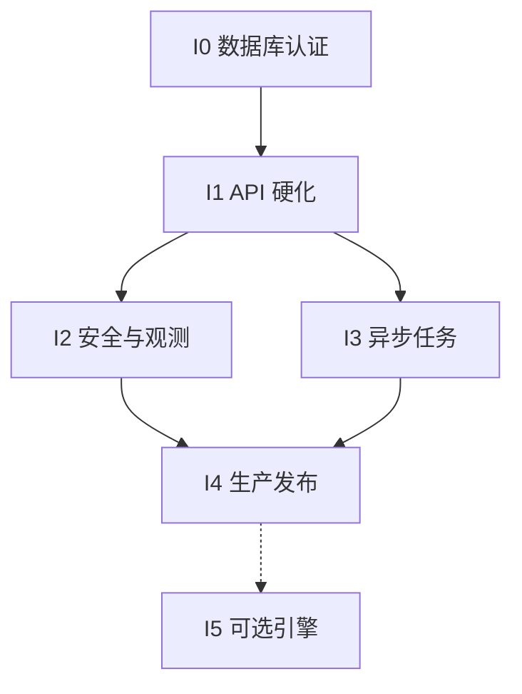

# H3 Spatial Toolkit 详细开发计划

## 1. 计划目标

以当前 `0.3.0` / Codex 模板 `1.4.0` 本地强化基线为起点，把系统推进到可认证的生产级共享空间基础服务。当前优先把已分别验证的数据库切片收敛为一份获授权的 run-scoped G4 证据，同时将平台中立鉴权接入具体 IdP/租户/Gateway，并让已定义的跨平台 CI 在托管 Runner 上真实执行；随后补异步大任务、Load/Soak、HA/DR 和生产发布。

## 2. 角色建议

| 角色 | 主要职责 |
|---|---|
| Tech Lead | 架构、ADR、接口/Schema 兼容和最终门禁 |
| Toolkit Engineer | Core/Geometry/Analysis、性能和 Golden Tests |
| Platform Engineer | API、身份、限额、OTel、Job/Worker |
| Data Engineer | PostgreSQL H3/PostGIS、分区、查询计划、恢复 |
| QA/SRE | 边界、负载、安全、部署、SLO 和证据归档 |

小团队可以合并角色，但不能省略对应门禁。

## 3. 里程碑

| 迭代 | 建议投入 | 目标 | 退出条件 |
|---|---:|---|---|
| I0 | 1–3 人日 + 授权等待 | 收敛完整 run-scoped 数据库认证 | G4 PASS |
| I1 | 已完成（本轮） | 同步 API 生产硬化 | G1/G2 强化项 PASS |
| I2 | 6–10 人日 | 具体 IdP/租户/Gateway、镜像供应链和平台观测 | G5 PASS |
| I3 | 10–15 人日 | 异步大任务平台 | Async Gate PASS |
| I4 | 8–12 人日 | HA、恢复、升级与生产发布 | G6/G7 PASS |
| I5 | 按证据立项 | DuckDB/ClickHouse 等 Adapter | Cross-engine Gate PASS |

投入仅用于排期参考，实际以目标数据规模、组织平台复用能力和门禁证据为准。

### 3.1 当前剩余工作量评估

以下按“已有可复用 IdP、Gateway、容器平台和托管 PostgreSQL”的中等复杂度团队估算；不把等待审批/采购的日历时间计入人日，也不把 I5 可选引擎计入必需范围。

| 完成口径 | 还需投入 | 主要内容 | 置信度 |
|---|---:|---|---|
| 本地源码模板 | 0–1 人日 | 当前源码 Gate 和真实浏览器矩阵已通过；处理最终评审/远端 CI。用户已明确排除本轮新源码 ZIP 交付审计 | 高 |
| 数据库支持的受控候选 | 1–3 人日 + 授权等待 | 获批执行严格 runner、审阅同一 run-id 下的最终镜像/规模/计划/恢复证据 | 中高 |
| 生产同步服务 | 18–31 人日 | 上述 + 具体 IdP/Tenant/Gateway、平台 OTel/SLO、Load、镜像漏洞处置/签名、HA/DR、CI/Owner/发布 | 中低 |
| 含异步大任务的完整目标 | 28–46 人日 | 生产同步服务 + Job/Worker/Result Store | 中低 |

单人串行约为 5–9 周；3 人并行且目标平台已就绪时约 2–4 周。估算减少来自严格数据库 runner、真实浏览器矩阵、可比较 Benchmark gate 和本地 fail-closed 鉴权边界。最大不确定性不在 H3 算法，而在破坏性本地认证授权、IdP/租户模型、镜像漏洞处置、目标平台接入、RTO/RPO 和组织批准。若这些决策尚未完成，日历周期会明显长于编码人日。

## 4. I0 — 目标环境认证

### P0-DB-CERT-001：数据库镜像与扩展认证

依赖：无。

工作：

1. 构建 PostgreSQL 17 + PostGIS 3.5 + H3/H3 PostGIS 4.5.0 镜像。
2. 执行 `001_extensions.sql`、`002_schema.sql` 和 SQL Smoke。
3. 验证 Point→Cell、Cell→Boundary、Polygon→Cells。
4. 验证模板已修正的四列 Upsert conflict target。
5. 记录扩展版本、镜像 digest、构建日志、执行环境、100K/1M/10M 计划、逻辑恢复指纹和生命周期结果。

当前进展：严格 Schema/Upsert、13 个 Adapter、四类计划探针、100K/1M/10M、扩展升级和 DDL 回滚均已作为本地切片通过。完整 runner 会重建本地合成认证库并创建/删除隔离生命周期数据库，正等待用户明确授权。

验收：`pnpm acceptance:database` 在同一 run-id 下完整通过；证据写入 `output/acceptance/database/runs/<run-id>/`，聚合 Gate 才能由 `PARTIAL` 升为 `PASS`。

### P0-GOLDEN-001：h3-js/h3-pg 一致性

依赖：P0-DB-CERT-001。

数据集：东京已知点、Resolution 0/15、Pentagon、极区、Antimeridian、Polygon hole、MultiPolygon。Node 期望值和 PostGIS runner 已在模板 v1.4.0 预置；本地数据库对照 11/11 已通过，剩余工作是随完整 G4 run-id 重新绑定最终镜像证据。

验收：Point/Parent/Boundary/Polygon 集合在定义的容差和集合语义内一致；差异有 ADR。

### P0-QUERY-001：查询计划与数据模型

依赖：P0-DB-CERT-001。

工作：

- 为 `spatial_feature.h3_cell` 增加写入一致性策略。
- 增加 `h3_get_resolution(cell)=resolution` 约束或等价门禁。
- 对两阶段查询执行 `EXPLAIN (ANALYZE, BUFFERS)`。
- 验证 H3 B-tree、Geometry GiST、时间索引和 Parent partial index。
- 建立 100K/1M/10M 数据规模结果。

当前进展：四类计划断言与 100K/1M/10M 本地切片已通过。验收仍要求完整 G4 run-id 内没有 Sequential Scan 异常或未解释的回退。

## 5. I1 — 同步接口硬化

### P1-API-HARDEN-001：统一错误和请求元数据

- 输出稳定业务错误码，不再只返回类名。
- 增加 `requestId`、engine/toolkit version、duration、warnings。
- 错误 details 使用 allow-list，生产不返回堆栈、SQL 或内部路径。
- OpenAPI、SDK、CLI 和测试同步更新。

### P1-LIMIT-001：资源和结果限额

- `MAX_RESULT_CELLS`、`MAX_GEOJSON_BYTES`、`ALLOWED_RESOLUTIONS`。
- Polygon 面积/Cell 预估；Neighbor radius+result 双限制。
- Flow 按总点数而非仅轨迹数限制。
- Distinct 高基数限制或近似策略。
- 超限返回可操作建议和推荐 Resolution。

### P1-VALIDATION-001：语义校验

- Coverage visited Cell 合法性和 Resolution。
- Flow origin/destination Resolution。
- Geometry depth、coordinate count、类型、SRID/validity 策略。
- Line path 失败不再静默产生可误解的连续结果。

退出：契约、错误、恶意输入和资源上限测试全部通过，G1/G2 更新为 `PASS`。

## 6. I2 — 安全与可观测性

### P1-AUTH-001

- 已完成：默认本地模式；`required` 模式缺 authenticator 时启动失败；异常/空/畸形 Principal、Scope 不足稳定返回 401/403。
- 已完成：六个业务端点和 Metrics 使用固定 Scope，Tenant 只来自已验证 Principal，不接受调用方 Body/Header 覆盖。
- 待完成：接入具体 OIDC/JWKS 或服务间 mTLS，覆盖 expiry/revocation/rotation，并把 Principal 传播到数据库、Job 和结果下载的持久租户隔离。

### P1-OBS-001

- Fastify requestId 与结构化日志。
- OTel spans：validate/estimate/compute/db/serialize。
- 请求、时延、输入、结果、错误、DB 和 Job 指标。
- Dashboard、告警和 SLO burn-rate。

### P1-SUPPLY-001

- 生成 SBOM、依赖/镜像扫描、License Notice。
- 基础镜像 digest pin、最小运行镜像、签名和 provenance。
- 依赖升级采用 lockfile + Golden + Benchmark 门禁。

当前基础/应用/数据库镜像已固定 digest 并执行本地扫描，但当前 Critical/High 阈值仍失败；最终计数与处置结论以 `P1-SUPPLY-001` 和供应链证据为准，签名/provenance 仍依赖 Registry。

退出：G5 PASS。

## 7. I3 — 异步大任务

### P2-JOB-001：Job Contract

- Job 状态：`PENDING/RUNNING/SUCCEEDED/FAILED/CANCELLED/EXPIRED`。
- 创建、状态、取消、结果 API。
- `idempotencyKey`、tenant、输入 hash、版本和 TTL。

### P2-WORKER-001：Worker Runtime

- 队列 lease、heartbeat、retry、dead letter。
- Polygon/aggregation 分片、checkpoint 和取消检查。
- 幂等键：`jobId + partition + algorithmVersion`。

### P2-RESULT-001：结果存储

- 小结果分页返回；大结果写对象存储。
- 输出 JSON/NDJSON/CSV/GeoJSON，可选 Parquet/Arrow。
- 保存 checksum、record count、schema version 和过期时间。

退出：5M+ Cell/record 任务不阻塞同步 API；重启、重复投递和取消测试通过。

## 8. I4 — 生产发布

- API/Worker 多副本、滚动发布和优雅停机。
- PostgreSQL 主备、backup/restore、PITR 和扩展升级演练。
- 并发、Soak、内存、失败注入和容量模型。
- 配置/Secret 管理、网络策略、readiness 和运维手册。
- 完成 Release Checklist、回滚、值班和事件响应。

退出：G6/G7 PASS，发布状态从 `CONDITIONAL` 升级为 `PRODUCTION_READY`。

## 9. I5 — 可选执行引擎

只有真实负载证明 Node/PostgreSQL 不满足目标时才立项：

1. DuckDB H3 + Spatial + GeoParquet/Arrow：离线和单机批处理。
2. ClickHouse H3×Time Cube：十亿级遥测和长期聚合。
3. Sedona/Spark/Flink：已有分布式 ETL 平台时接入。

每个 Adapter 必须复用标准 Schema、Resolution/Coordinate Policy，并通过 Cross-engine Golden Tests。

## 10. 关键路径

I1 已在数据库认证之前获准并行完成；I0 仍是生产工作的首要阻塞项。I0 完成后 I2/I3 可并行，但 G7 生产发布必须等待二者及 I4 全部通过。

## 11. 变更控制

- 公共 Schema/API breaking change：新增 ADR，并使用 `/v2` 或新 Schema version。
- H3/H3-pg 版本变化：Golden + Boundary + Benchmark + DB Upgrade Gate。
- 新执行引擎：不得改变外部坐标、Resolution 和标准对象语义。
- 门禁阈值变化：记录旧值、新值、负载证据和回滚条件。

## 12. 非功能工程工作流

功能里程碑之外的治理、测试、发布、平台和组织任务在 `docs/29_UNFINISHED_WORK_REGISTER.md` 与 `tasks/backlog/` 单独跟踪，不能隐藏在功能任务中：

| 轨道 | Work Item | 完成条件 |
|---|---|---|
| Database lifecycle | P0-DB-CERT、P0-GOLDEN、P1-DB-MIGRATION | G4/G6 实机证据 |
| Browser quality | P1-BROWSER-A11Y | Windows Playwright Chromium/Firefox/WebKit 9/9 已完成；托管/跨平台持续矩阵由 Cross-platform/CI 轨道继续 |
| Capacity | P1-LOAD-SOAK | 并发、长稳、故障注入报告 |
| Security/data | P1-SEC-OBS、P1-DATA-GOV、P1-SUPPLY | Auth/Tenant/Data/SBOM/签名证据 |
| Platform | P1-DEPLOY-DR、P1-CROSS-PLATFORM、P1-CI-CERT | 部署、恢复和矩阵执行记录 |
| Governance/release | P1-GOV-OWNER、P1-PUBLISH、P1-RELEASE | 真实 Owner、批准链和分发演练 |

每个轨道可以与功能开发并行，但不能绕过依赖，也不能因模板提供了脚本或 Workflow 就提前完成。
