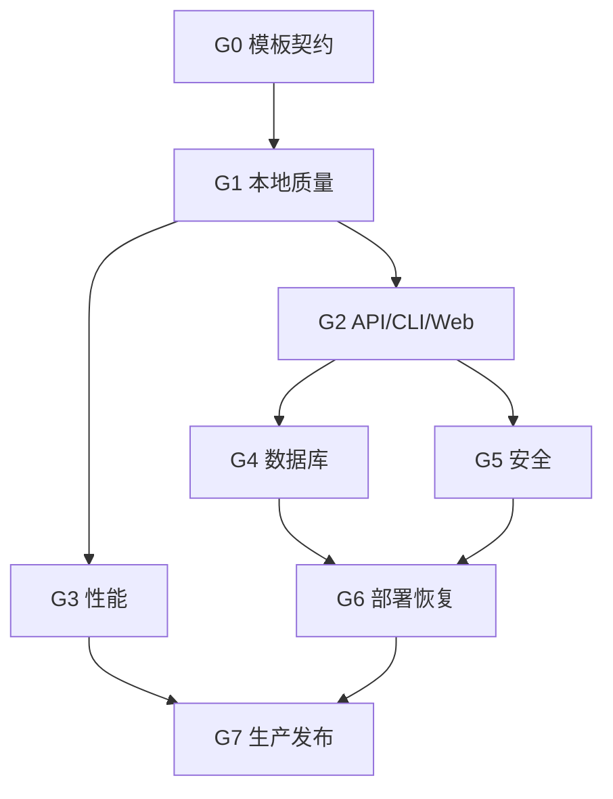

# H3 Spatial Toolkit 验收门禁

## 1. 门禁原则

1. 门禁必须由可重复命令和保存的证据支撑。
2. 上游 Gate 未通过时，下游不得标记通过。
3. 环境缺失使用 `NOT_RUN`；已知失败使用 `BLOCKED`；部分覆盖使用 `PARTIAL`。
4. 不能通过关闭测试、降低阈值、跳过安全检查或删除失败用例来获得 PASS。
5. 生产发布要求 G0–G7 全部 PASS。

## 2. Gate 总览



## 3. G0 — Template Contract、Documentation、Repository

命令：

```bash
pnpm check:contract
pnpm check:docs
pnpm check:repository
pnpm check:shell
```

验收项：

- `AGENTS.md`、Codex 入口、详细设计、开发计划、门禁、追踪和可信访问策略存在。
- `template.json` 与 `.codex/project-state.json` 可解析。
- 八个 Package、三个 App、数据库、测试和 Benchmark 目录存在。
- package scripts 包含本地、API、数据库和完整验收入口。
- `h3_metric` 主键和 Upsert conflict target 静态一致。
- 设计包含 FR-001–FR-012，追踪矩阵覆盖全部需求。
- Markdown fence、相对链接和必需章节有效，不引用瞬态沙箱路径。
- JSON、版本、依赖 pin、任务结构、Secret/key 文件、可执行脚本和 PASS 证据引用符合仓库政策。
- Bash 脚本通过 syntax、portable shebang、strict-mode、可执行位和危险构造基线；ShellCheck 缺失时保持专项任务 `PARTIAL`。

子门禁：`G0_TEMPLATE_CONTRACT`、`G0_DOCUMENTATION`、`G0_REPOSITORY_POLICY`、`G0_SHELL_BASELINE`。证据为命令、环境、退出码和 `evidence/gates/` 摘要。

## 4. G1 — Local Quality

命令：

```bash
pnpm acceptance:local
```

包含：

1. G0 Contract/Docs/Repository、Prettier 和 ESLint。
2. TypeScript `strict` 类型检查。
3. Vitest Unit/Geometry/API/CLI 测试和 Coverage threshold。
4. 所有 workspace build。
5. OpenAPI/JSON Schema 校验与向后兼容检查。
6. 生产依赖 License Policy 和 `pnpm audit --prod`。
7. 冻结 Golden 与 CycloneDX/Third-party Notice 漂移检查。

阈值：

| 指标 | 最低 |
|---|---:|
| Total lines | 80% |
| Total functions | 80% |
| Total statements | 80% |
| Total branches | 75% |
| Core lines | 80% |
| Geometry lines | 90% |
| 测试失败 | 0 |
| Type errors | 0 |
| 已知生产依赖漏洞 | 0 Critical/High；其他有处置记录 |

任何被 skip 的测试必须列出原因；PostGIS skip 不计为数据库 PASS。

## 5. G2 — Contract、API、CLI 与 Web

命令：

```bash
pnpm acceptance:api
pnpm check:contracts
pnpm --filter @h3-toolkit/web-demo build
```

API 验收：

- 根命令可启动 API。
- `/health` 返回 200 和准确 engine version。
- OpenAPI 包含 health、readiness、metrics 和 6 个业务端点。
- Point 已知金标：东京 `{139.7671,35.6812}` Res 9 → `892f5a32d97ffff`。
- Validation 400、业务语义 422、未知错误 500，不暴露堆栈。
- Batch/body/timeout 配置生效。
- SIGTERM 能关闭服务。

CLI 验收：

- Point JSON。
- Polygon→Cell CSV。
- Neighbors、Aggregate、Coverage、Flow 正向用例。
- 非法参数退出非 0；stdout/stderr 分离。

Web 验收：

- Production build 通过。
- Resolution 5–12 可切换。
- WebGL deck.gl 和 SVG fallback 都有浏览器证据。
- 显示 Cell 数、Renderer 和坐标顺序。
- Deck.gl 必须为异步 chunk，entry/async/total 均通过 `BUNDLE_BUDGET.json` 自动预算。

G2 分为三个子门禁：

- `G2_API_CONTRACT`：OpenAPI 可解析、JSON Schema 正反例和 `/v1` 兼容基线，当前 Work 可执行。
- `G2_API_CLI`：编译产物 API/CLI Smoke，当前 Work 可执行。
- `G2_WEB_BUNDLE`：Vite production build、Deck.gl 动态拆包和 bundle budget，当前 Work 可执行。
- `G2_BROWSER_ACCESSIBILITY`：真实 WebGL/SVG fallback、浏览器矩阵和可访问性；只有 Production build 时必须保持 `NOT_RUN`。

## 6. G3 — Performance

命令：

```bash
pnpm benchmark
```

必须实测而非推算：

- Point→H3：10K、100K、1M、10M。
- Aggregation：1M、10M。
- Polygon：Small、Medium、Large。

每项记录：环境、版本、records/cells、duration、throughput、RSS delta、checksum/total。

回归策略：

- 同硬件和同 Node/H3 版本，P95 或中位耗时恶化超过 20% 时阻断并解释。
- 结果 checksum/total 必须一致。
- 10M 不得使用低规模外推。
- 大 Polygon 必须记录输出 Cell 数，避免只比较输入面积。

`G3_PERFORMANCE` 是单机算法门禁；`G3_LOAD_SOAK` 是目标集群的并发、P95/P99、长稳和故障注入门禁。二者分开记录，前者 PASS 不会提升后者状态。

## 7. G4 — PostgreSQL H3/PostGIS

前提：Docker/Compose、足够磁盘和允许构建 native extension；psql/pg_dump/pg_restore 使用认证镜像内工具，本地 psql 非硬依赖。

命令：

```bash
docker compose up -d --build
pnpm acceptance:database
```

验收项：

| 类别 | 验收 |
|---|---|
| 镜像 | PG/PostGIS/H3 版本固定；容器 healthy |
| Migration | extensions/schema 全部成功且可重复执行 |
| Point | h3-js/h3-pg 金标一致 |
| Geometry | Boundary、Polygon、hole、MultiPolygon、Antimeridian 策略 |
| Schema | Cell/Resolution 一致约束；四列 Upsert 成功 |
| Query | H3 B-tree 粗筛 + GiST exact filter |
| Plan | 保存 `EXPLAIN (ANALYZE, BUFFERS)` |
| Scale | 100K/1M/10M 数据量测试 |
| Lifecycle | 备份、恢复、扩展升级和回滚演练 |

当前脚本已经自动化扩展版本、Migration 重复执行、Smoke、10K Fixture、两类 EXPLAIN、Cross-engine Golden、custom-format backup/restore 和 count/checksum 证据。10K 仅用于流程认证，100K/1M/10M 性能与升级/回滚仍需目标环境补充。

证据目录建议：

```text
output/acceptance/database/
├── environment.json
├── extension-versions.txt
├── migration.log
├── integration-test.log
├── explain-two-stage.txt
├── explain-aggregate.txt
├── benchmark.json
└── restore-rehearsal.md
```

当前模板默认状态为 `NOT_RUN`，只有实际输出上述证据后才能改为 PASS。

## 8. G5 — Security and Supply Chain

当前 Work 可执行：

```bash
pnpm check:repository
pnpm check:licenses
pnpm audit --prod
pnpm check:supply-chain
```

它们分别支撑 `G5_SECRET_SCAN`、`G5_LICENSE_POLICY`、`G5_DEPENDENCY_AUDIT` 与 `G5_SBOM_SOURCE`，但不能自动把聚合 Gate `G5_SECURITY` 标成 PASS。

`G5_OBSERVABILITY_LOCAL` 只验证结构化日志认证头脱敏、低基数 Prometheus 指标、统一错误和 readiness；它不覆盖 OIDC/Tenant、跨实例 OTel、Dashboard/Alert/SLO 或生产日志平台。

验收项：

- OIDC/mTLS 身份验证；Scope/Role 授权。
- Tenant 来源可信且不可由 body 覆盖。
- Rate limit、tenant quota、body/batch/result/timeout/depth 限制。
- 恶意 Polygon、超大 k、高基数 distinct 和压缩炸弹测试。
- 错误和日志不包含坐标全集、Token、SQL、Secret 或内部堆栈。
- 参数化 SQL；数据库账户最小权限。
- Production dependencies、container image、SBOM 和 License 扫描。
- 镜像 digest pin、签名和 provenance。
- Secret 不进入 Git、ZIP、镜像层或测试输出。

阻断条件：Critical/High 漏洞无处置、鉴权绕过、跨租户访问、Secret 泄露或资源限额可被绕过。

`G5_SBOM_SOURCE` 只证明 npm 生产依赖的 CycloneDX 1.6 inventory 与许可清单可再生。`G5_AUTH_TENANT`、基础/发行镜像扫描、签名与 provenance 必须在真实 IdP/Gateway/Registry 环境执行；源码 SBOM PASS 时 `G5_SBOM_IMAGE_SIGNING` 仍只能是 `PARTIAL`。

## 9. G6 — Deployment and Recovery

验收项：

- API 至少双副本，readiness/liveness 区分。
- Rolling update、SIGTERM drain 和 rollback。
- PostgreSQL 主备或受管 HA。
- Backup、restore/PITR、扩展升级和回滚。
- 配置和 Secret 由平台注入，启动时验证。
- Load、Soak、故障注入、依赖故障和网络抖动。
- Dashboard、SLO、告警、Runbook 和值班归属。
- RTO/RPO 由业务批准并通过演练。

G6 至少拆分为 `G6_CONTAINER_RUNTIME`、`G6_HA_RECOVERY`、`G6_CROSS_PLATFORM`。Compose/YAML 静态存在只允许聚合状态为 `PARTIAL`，不能产生任何运行子门禁 PASS。

`G6_GRACEFUL_SHUTDOWN_LOCAL` 通过编译产物 loopback smoke 验证 SIGTERM 后 Fastify close、3 秒内干净退出和 exit code 0；它不证明容器 drain、负载下关停或滚动发布。

`G6_PRODUCTION_LAYOUT_LOCAL` 验证 production-only pnpm deploy、无开发依赖、50 MiB 预算、non-root Dockerfile、readiness 和关停；它不证明 Docker 镜像能够在目标平台构建或通过扫描。

## 10. G7 — Source Package 与 Production Release

当前 Work 可执行源码包门禁：

```bash
pnpm check:release
```

`G7_RELEASE_METADATA` 校验 Project/Template 版本、Changelog、源码必需 Gate 和生产 Gate 不得绕过。`G7_RELEASE_PACKAGE` 验证固定时间戳 Manifest、文件 SHA-256、两次 ZIP 哈希一致、Release Summary、解压完整性和敏感/生成文件排除。二者只允许状态升级为 `SOURCE_TEMPLATE_READY`。

`G7_PRODUCTION_RELEASE` 只在 G0–G6 全部 PASS 后评审。Production Release 必须另外包含：

- 完整源码和 lockfile。
- OpenAPI 与 JSON Schema。
- 版本化迁移和升级说明。
- 测试、覆盖率、Benchmark、数据库、Security、Deployment 证据。
- SBOM、License Notice、镜像 digest/签名。
- Release Notes、已知限制、Runbook、Rollback。
- `MANIFEST.json` 与 `SHA256SUMS`。

最终判定：

| 状态 | 含义 |
|---|---|
| `PASS` | 本 Gate 全部验收项通过 |
| `CONDITIONAL_PASS` | 仅允许受控环境，条件和截止时间明确 |
| `NOT_RUN` | 环境/时机未执行，不代表失败或通过 |
| `BLOCKED` | 已知失败或上游 Gate 未满足 |

## 11. 证据格式

每次门禁执行至少记录：

```json
{
  "gate": "G1_LOCAL_QUALITY",
  "status": "PASS",
  "executedAt": "2026-08-11T00:00:00Z",
  "environment": {
    "node": "v24.x",
    "platform": "linux",
    "arch": "x64"
  },
  "commands": ["pnpm acceptance:local"],
  "artifacts": ["coverage/coverage-summary.json"],
  "notes": []
}
```

执行日志写入 `output/acceptance/<gate>/`；目录默认不进入发行源码包。可版本化、去敏后的摘要写入 `evidence/gates/<GATE>.json`。只有真实执行且退出码为 0的 Gate 才能写 `PASS`。
